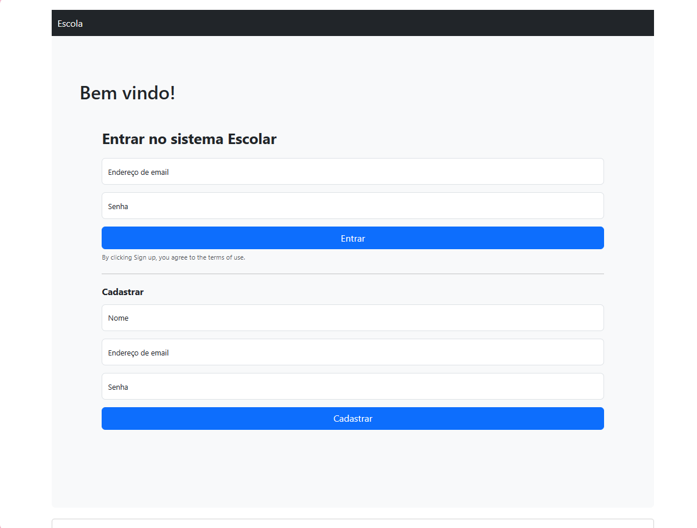

# Trabalho Mario - Escola NodeJs

## Como executar

Para poder executar, é necessário ter um banco MySQL rodando na porta 3306. Se preferir, pode usar Docker para executar o sistema.

```
docker compose up 
```

ou, se preferir, pode executar com:

```
npm run start:dev
```

## Algumas das telas

### Home



### Aluno

#### Cadastrar alunos


#### Todos os alunos


#### Editar aluno


### Turma

#### Cadastrar turma


#### Todas as turmas


#### Editar turma


----
